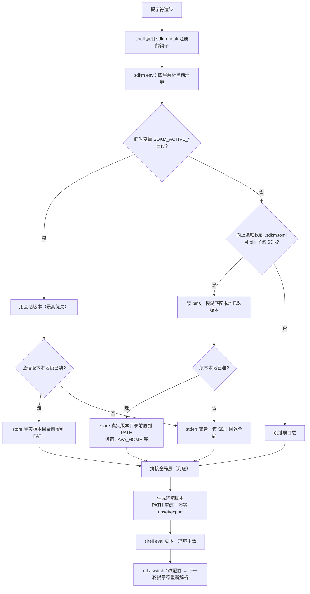
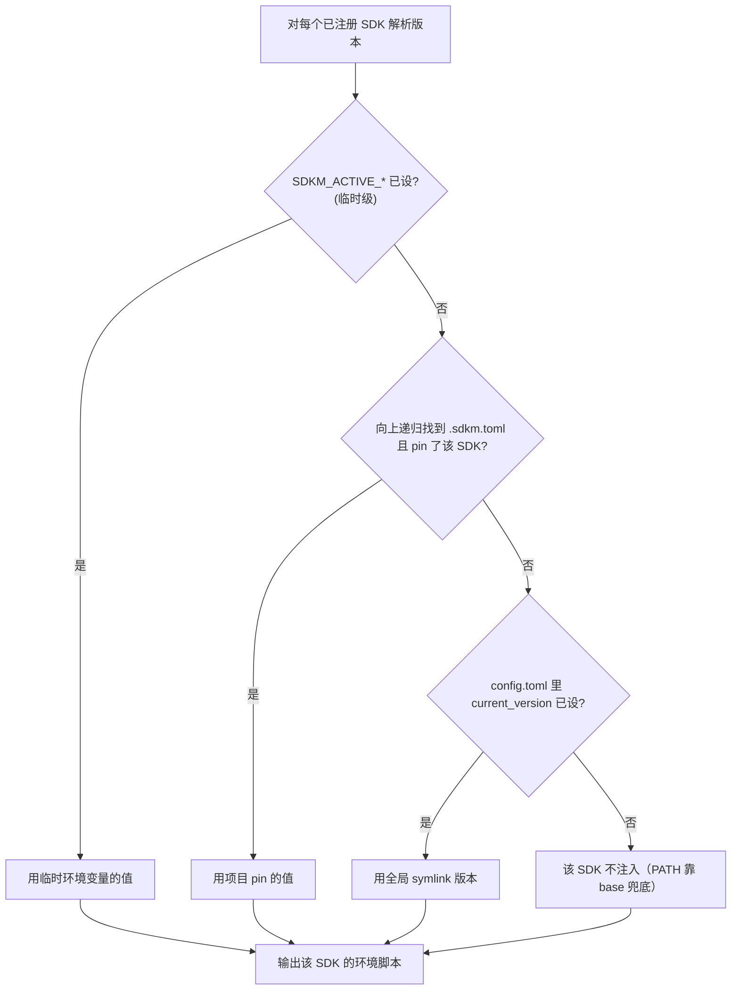

# 详细用法

本节是 sdkm 的完整使用文档入口。如果你只想要「30 秒跑起来」，看 [项目 README](../README.md#快速开始) 即可。

## 文档导航

| 文档 | 内容 |
|:---|:---|
| [commands.md](./commands.md) | 每个子命令的参数、别名、行为与示例（init / install / list / switch / use / env / hook / current / config / self） |
| [configuration.md](./configuration.md) | `config.toml` 结构、每个配置项含义、类型校验规则、写入安全机制 |
| [custom-sdk.md](./custom-sdk.md) | 用 `add-sdk` 注册任意工具为自定义 SDK、URL 模板占位符系统 |

本文档章节索引：

- [项目级版本管理](#项目级版本管理) — `.sdkm.toml` + `sdkm use`，版本随目录自动切换
- [Shell 支持与 Hook 注册](#shell-支持与-hook-注册) — 4 种 shell 支持与手动注入 / 重置
- [工作原理](#工作原理) — hook 生效流程图、四层优先级、关键机制（技术参考）

## 30 秒快速上手

```bash
# 1. 初始化（首次使用）
sdkm init

# 2. 安装一个 SDK（支持模糊匹配，自动切换）
sdkm install java 21

# 3. 或者把已有的本地 SDK 交给 sdkm 托管：
#    放到 <sdkm所在目录>/store/java/21/ 下，sdkm 会自动发现

# 4. 列出与切换
sdkm list                  # 查看所有已安装 SDK + 当前版本
sdkm list node -r          # 交互式浏览远程 Node.js 版本，按 i 安装
sdkm switch java 17        # 切换到本地已安装的 Java 17
sdkm current               # 查看当前激活版本
```

## 把已有 SDK 交给 sdkm 托管

sdkm 不强制从远程安装。你可以把已经装好的 SDK 直接放进 `store/` 目录，sdkm 会自动发现并纳入管理：

```
<sdkm所在目录>/store/java/21/      # JDK 21
<sdkm所在目录>/store/node/22/      # Node.js 22
<sdkm所在目录>/store/python/3.12/  # Python 3.12
```

放进目录后 `sdkm list java` 即可看到，`sdkm switch java 21` 即可切换。**无需手动配置环境变量、无需重启终端**——切换后通过符号链接 + PATH 注入实时生效。

## 项目级版本管理

不同项目用不同版本是全栈工程师的常态：A 项目 Java 21、B 项目还在 Java 17。`sdkm use` 让版本**随目录自动切换**——进目录用项目版本，离开还原全局，改完 `.sdkm.toml` 按回车即热更新，不用重开终端。

> **推荐用项目级（`sdkm use`，默认）而非临时级（`--shell`）**。项目级把版本写进 `.sdkm.toml`，持久留存、可提交版本库与团队共享、`cd` 进出该目录自动切；临时级只对当前终端生效，关掉终端即失效、换一个终端又要重来，也不便复现。临时级更适合「临时覆盖某个项目版本跑一次测试」这类一次性场景。

在项目根目录放一个 `.sdkm.toml`，摊平写 SDK → 版本：

```toml
java = "21"
node = "20.11.0"
```

用法：

```bash
# 项目级：在当前目录写 .sdkm.toml（默认）
sdkm use java 21              # '21' 模糊匹配本地已装的最新 21.x
sdkm use node 20.11.0

# 临时级：只对当前终端生效，不写文件（优先级最高，覆盖项目与全局）
eval "$(sdkm use --shell java 21)"     # bash / zsh
sdkm use --shell java 21 | source      # fish
Invoke-Expression ((sdkm use --shell java 21) -join [Environment]::NewLine)  # PowerShell
```

几点须知：

- **先注入 hook**：项目级 / 临时级靠 shell hook 自动生效，未注入时只有 `switch`（全局）有效。先跑 `sdkm init`（见下节 [Shell 支持与 Hook 注册](#shell-支持与-hook-注册)）。
- **未装会降级**：`sdkm use java 21` 时若 21 本地没装，仍写入意图，但自动回退全局版本并提示你装；临时级（`--shell`）则要求版本必须已装，否则报错。
- **建议提交版本库**：团队 clone 后 `sdkm init` 即自动用对版本（前提是各自本地已装）。

> 三种作用域如何排序、hook 如何读 `.sdkm.toml`、未装降级与离开目录自动还原的内部机制，见 [工作原理](#工作原理)。

---

## Shell 支持与 Hook 注册

项目级 / 临时级版本切换依赖 shell hook。sdkm 支持 4 种 shell，`sdkm init` 会自动检测当前 shell 并把 hook 注入到对应 profile：

| Shell | profile 路径 |
|:---|:---|
| **bash** | `~/.bashrc` |
| **zsh** | `~/.zshrc` |
| **fish** | `~/.config/fish/config.fish` |
| **PowerShell** | `Documents\PowerShell\Microsoft.PowerShell_profile.ps1`（PS7）+ `Documents\WindowsPowerShell\Microsoft.PowerShell_profile.ps1`（PS5.1） |

> PowerShell 会同时注入 PS7 + PS5.1 两个 profile（用户日常可能用任一版本）。注入后 **重启 shell** 生效。日常无需手动操作，以下仅在你需要手动注入、重置或排查时参考。各 shell 的 hook 触发机制与 PATH 持久化方式见 [工作原理](#工作原理)。

### 自动注入（推荐）

```bash
sdkm init            # 自动检测 $SHELL 并注入 hook 到对应 profile
```

重复跑 `sdkm init` 安全——已注入会跳过（去重），不会重复追加。

### 手动注册 hook

若 `init` 没注入成功（如 profile 路径非标准、权限问题），或你想注入到非当前 shell，可手动把 `sdkm hook` 的输出加进 profile：

#### bash

把这行加进 `~/.bashrc`：

```bash
eval "$(sdkm hook bash)"
```

#### zsh

把这行加进 `~/.zshrc`：

```zsh
eval "$(sdkm hook zsh)"
```

#### fish

把这行加进 `~/.config/fish/config.fish`：

```fish
sdkm hook fish | source
```

> fish **必须用 `| source`**，不能用 `eval (sdkm hook fish)`——fish 的命令替换按换行拆参、eval 空格连接会把多行脚本压成一行而破坏语法。

#### PowerShell

把这行加进你的 `$PROFILE`（PS7 是 `Documents\PowerShell\Microsoft.PowerShell_profile.ps1`，PS5.1 是 `Documents\WindowsPowerShell\Microsoft.PowerShell_profile.ps1`）：

```powershell
Invoke-Expression ((sdkm hook powershell) -join [Environment]::NewLine)
```

> 必须用 `-join [Environment]::NewLine` 拼回单字符串再 IEX；PS 5.1 把原生命令输出按行捕获成数组，直接 IEX 会报「意外标记 }」。脚本须 ASCII（中文系统 GBK 代码页下非 ASCII 会破坏引号配对），`sdkm hook` 输出已保证 ASCII。

保存后重启 shell（或 `source ~/.bashrc` / `source ~/.zshrc` / 重开 fish / `. $PROFILE`）即生效。

### 查看 hook 脚本内容

不修改任何文件，只打印脚本：

```bash
sdkm hook bash           # 看 bash hook 脚本
sdkm hook fish
sdkm hook powershell
sdkm env --shell bash    # 看当前目录会 eval 的环境脚本
```

### 重置 / 卸载 hook

`init` 注入的 hook 在 profile 里以注释块标记，整块删除即可：

```bash
# profile 里的形态（bash/zsh 示例）：

# sdkm project-level version hook
eval "$(sdkm hook bash)"
```

手动删掉这一行（fish 删 `sdkm hook fish | source`、PowerShell 删那一整行 `Invoke-Expression ...`）即可卸载 hook。删后 `sdkm switch`（全局符号链接）仍正常工作，只是项目级 / 会话级自动切换不再生效。

### Windows 重置 PowerShell profile

收到 `Shell hook already injected in your PowerShell profile` 提示、想重新验证功能时：

```powershell
# 1. 看 $PROFILE 实际路径（PS7 / PS5.1 各自一个）
$PROFILE

# 2. 用编辑器打开（或 notepad）
notepad $PROFILE

# 3. 删掉这两行（整块）：
#   # sdkm project-level version hook
#   Invoke-Expression ((sdkm hook powershell) -join [Environment]::NewLine)
# 保存后重开 PowerShell

# 4. 重新注入
sdkm init
```

> 若你把 Documents 重定向到了非默认盘（如 D 盘），sdkm 会读注册表 `User Shell Folders\Personal` 定位真实路径，不会注入错文件。

---

## 交互式 TUI

`sdkm list <sdk>` 和 `sdkm list <sdk> -r` 会进入交互式版本选择器：

- `↑` / `↓` 或 `k` / `j`：导航
- 本地选择器：`Enter` / `s` 切换版本
- 远程选择器：`i` 安装、`s` 切换
- `q` / `Esc` / `Ctrl+C`：退出

状态标记：`✅` 当前激活 / `📦` 已安装 / 空白 = 未安装。

## 配置

`sdkm config` 系列：

```bash
sdkm config list                              # 列出全部配置
sdkm config set network.proxy http://127.0.0.1:7890   # 设置代理
sdkm config set network.cache_ttl_secs 0      # 关闭版本缓存（每次都拉最新）
sdkm config edit                              # 用编辑器直接改 config.toml
```

完整配置项含义与校验规则见 [configuration.md](./configuration.md)。

## 自定义 SDK

内置只覆盖 Java / Node.js / Python / Maven / Go。任何能从 URL 下载解压的工具都能注册：

```bash
sdkm config add-sdk mytool \
  --download-url "https://example.com/mytool/{version}/mytool-{version}-{os}-{arch}.{ext}" \
  --bin-dir bin
```

详见 [custom-sdk.md](./custom-sdk.md)。

---

## 工作原理

本节是技术参考，讲 sdkm 内部如何协作。日常使用不需要读，排查问题或想深入理解时再看。

### 整体协作

sdkm 的版本切换靠三件事协作：**符号链接**（`switch` 全局生效）+ **shell hook**（`use` 项目/临时生效、`switch` 后按回车立即生效）+ **环境变量**（临时覆盖）。

核心洞察：**任何外部命令都无法修改父 shell 的环境变量**（子进程只拿到环境副本），所以 sdkm 不试图"帮你改当前终端"，而是让 shell 自己改——hook 注入到 profile 后，每次提示符渲染都由**你的 shell** 调用 `sdkm env`、把输出脚本 `eval` 进当前 shell。`sdkm env` 输出「此刻应有的完整环境」，全部四层（见下）动态计算，因此**任何版本变更（`switch`/`use`/改 `.sdkm.toml`）后按一下回车即生效，无需重启终端**。

### hook 生效流程

每次 shell 渲染提示符时，注入的钩子会调用 `sdkm env`，按当前目录重新生成环境脚本并 `eval`：



### 四层优先级解析

`sdkm env` 输出的 PATH = 四段拼接（同 SDK 只取最高命中层，不会重复出现）：

| 优先级 | 作用域 | 谁设置 | 载体 | PATH 条目来源 |
|:---:|:---|:---|:---|:---|
| 1（最高） | 临时 · 当前终端 | `sdkm use --shell` | `SDKM_ACTIVE_<SDK>` 环境变量 | store 真实版本目录 |
| 2 | 项目 · 当前目录及子目录 | `sdkm use` | `.sdkm.toml` pins | store 真实版本目录（绕过 symlink） |
| 3 | 全局 · 整个系统 | `sdkm switch` | `config.toml` 的 `current_version` | symlink 目录（`<symlink_dir>/<sdk>/bin`） |
| 4（兜底） | — | — | — | `_SDKM_BASE_PATH`（启动时的 PATH 快照，保住系统/用户路径） |



**关键点**：全局层不再是「还原启动快照」——sdkm 从 `config.toml` 权威状态（哪些 SDK 有 `current_version`）确定性推导出 symlink bin 路径，动态拼进 PATH。这保证了 `sdkm switch` 后**按一下回车**（hook 触发 `sdkm env`）新版本立即生效，不用重启终端；同 SDK 的项目 pin 依旧优先于全局（`covered` 去重保证每 SDK 只命中一层）。

### 关键机制

- **幂等重建 + base PATH**：hook 首次运行时把启动 PATH 存到 `_SDKM_BASE_PATH`；之后每次 `sdkm env` 都从 base 重建 PATH（四层 bins 前置到 base）。未选中的全局 env vars 幂等 `unset`、选中的 `export`（全局层选中的 SDK 也渲染 `{sdk_dir}`=symlink 目录的 extra_vars，如 JAVA_HOME）——重复执行不累积、不残留、离开目录自然还原。
- **stdout 纯净**：`sdkm env` / `sdkm hook` / `sdkm use --shell` 的 stdout 只吐脚本（供 `eval`/`source`/`IEX`），诊断信息一律走 stderr，不会污染 eval 出来的环境。
- **双指纹缓存**：`sdkm env` 按 PWD + shell 缓存生成的脚本，新鲜度判据 = `.sdkm.toml` mtime + **会话指纹**（`SDKM_ACTIVE_*` 变量集合）+ **全局指纹**（symlink_dir + 各 SDK `current_version` 集合，读自 config.toml）——任一变化即重算。这保证 `use --shell` 与 `switch` 后 hook 不会吐旧缓存脚本压过新状态。缓存读写失败静默降级为实时解析。
- **未装降级**：项目/临时级版本本地未装时，`sdkm env` 跳过该 SDK 并 stderr 警告，PATH/env 回退全局，不阻断 shell；临时级 `use --shell` 则要求必须已装，否则报错退出。
- **父级配置冲突检测**：`sdkm use` 写 `.sdkm.toml` 前向上探测父级是否已有配置，命中则 warning 提示覆盖关系（只提示不阻断）。
- **会话级无 unset 入口**：`SDKM_ACTIVE_*` 目前只有 set 路径，清除靠手敲——bash/zsh `unset SDKM_ACTIVE_JAVA`、fish `set -e SDKM_ACTIVE_JAVA`、PowerShell `Remove-Item Env:SDKM_ACTIVE_JAVA`。

### 各 shell 的 hook 触发与 PATH 持久化

| Shell | hook 触发机制 | PATH 持久化方式 |
|:---|:---|:---|
| bash | `PROMPT_COMMAND` | 单行重建 `export PATH=...` |
| zsh | `precmd`（`add-zsh-hook`） | 单行重建（同 bash） |
| fish | `fish_prompt` 事件 | 逐行 `fish_add_path --path` |
| PowerShell | 包装 `prompt` 函数 | 走注册表（Windows） |

> **为什么 profile 里持久化的 PATH 行不会与 hook 冲突**：hook 每次回车重建的 PATH（全局层 symlink bins + base）覆盖了持久化条目的语义——`switch` 维护 `config.toml` 的 `current_version` 与 profile 的 PATH 行一致，两者指向相同的 symlink 目录。profile 行只在「hook 未注入/首次启动」时兜底。

---

## ⚠️ 已知限制

坦诚面对当前状态，以下是使用时的注意事项：

- **Maven 无远程版本发现**：Maven 只有下载模板、没有版本发现接口，因此 `sdkm install maven <version>` 必须给精确版本号（如 `3.9.9`），不支持模糊匹配，`sdkm list maven -r` 会报错。自定义 SDK 不填 `--version-url` 时同理。
- **Windows 需管理员权限**：Windows 下环境变量与系统 PATH 写入 `HKEY_LOCAL_MACHINE`、创建符号链接需管理员权限，运行 `init`/`switch` 需管理员。
- **Python 远程列表**：主源（uv metadata）完整；备源（GitHub API）受 `per_page=100` 限制，仅返回最近 100 个 release，主源正常时不触发。
- **Java macOS aarch64 无 jdk8 包**：Adoptium 不提供 jdk8 的 macOS aarch64 构建（jdk8 在 macOS 仅 x64），Apple Silicon 上 `sdkm install java 8` 会报错，改用 `17`/`21` 等支持 aarch64 的版本。
